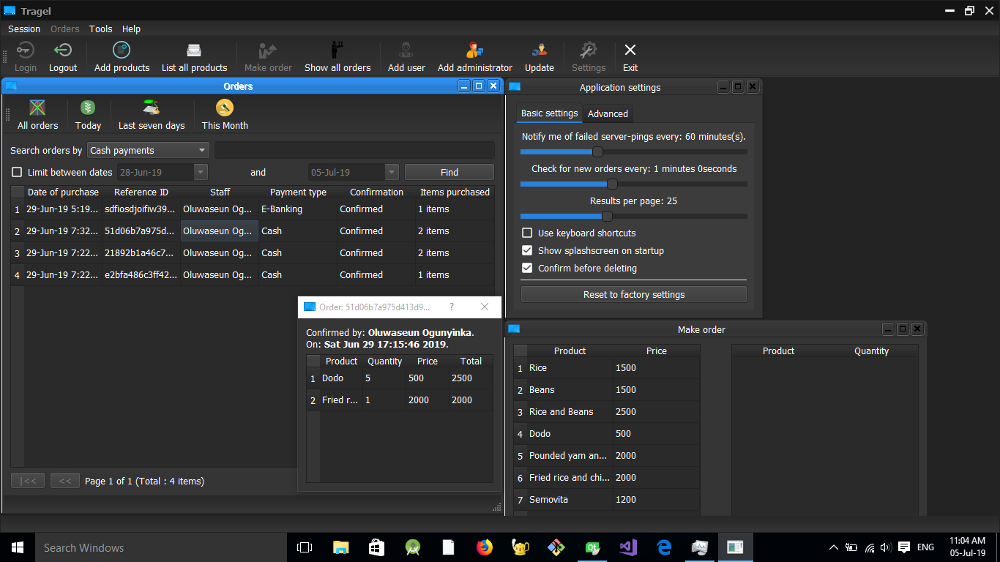

# TragelPC

This is my attempt to make a software that revolutionize how the society buy and sells. It is implemented with the concept of company and customers, although the company could be any small or medium scale enterprise or it could be an international conglomerate.

Companies, after installation, can register a number of their staffs and a/some administrators to take care of things. When orders are made, this Desktop Control Panel notifies almost immediately the administrators of the number of newer purchases. They, in turn, take care of how the products are delivered to their customers.

Customers have a mobile app that can be installed from the store or obtained from FAF. This app lists companies making use of Tragel based on the customer's location and thereafter the products showcased from the company chosen. Orders can be paid for in cash or using the mobile  banking system available in the app.

## Screenshot

